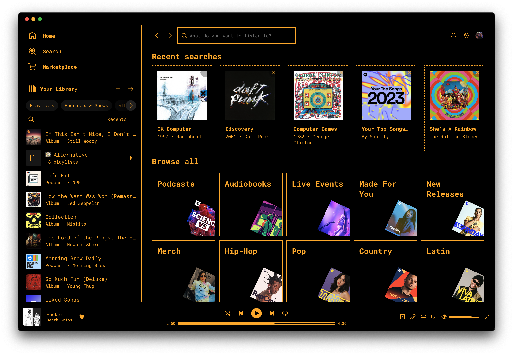

# 𝚃𝙴𝚁𝙼𝙸𝙵𝚈
Retro terminal-inspired theme for the Spotify desktop app. [Spicetify CLI](https://github.com/spicetify/spicetify-cli) must be installed to use.

### Installation
1. Clone this repo into a directory named `Termify` in your Spicetify Themes directory.
2. Run one of the below commands based on which color scheme you want:

#### Green
`spicetify config current_theme Termify color_scheme Green && spicetify apply`

#### Amber
`spicetify config current_theme Termify color_scheme Amber && spicetify apply`

